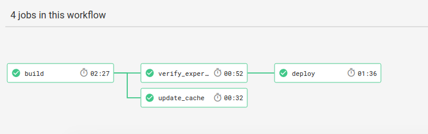

# Experiment Factory Builder

 - 
 - [Documentation](https://expfactory.github.io/builder)
 - [Writeup](https://vsoch.github.io/2018/experiment-builder)

This is the experiment factory builder. The experiment folders that you add to the folder
[experiments](experiments) will be built into an experiment factory Docker Container.
Generally, you should do the following:

  1. Put experiment subfolders in [experiments](experiments). Each should be served statically, and submit to `/next`
  2. Connect the repository to [Circle CI](https://www.circleci.org) to build your experiment container!
  3. Optionally, you can add a Docker Hub username and password, along with a custom container name, to the Circle CI environment. This will not only build and test, but will build, test, and deploy your experiment container for others to use.
