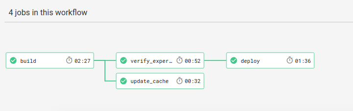

Welcome to the documentation for the [Experiment Container Builder]({{ site.repo }}) template. This documentation
and associated repository will help you to turn your static behavioral experiments into tested, reproducible containers to share with others, or you can select from our [container library](https://expfactory.github.io/experiments).

We are going to be combining three technologies to handle each of the following:

 - **Reproducibility** of software is handled by container technology
 - **Automation** is handled by the [Experiment Factory](https://expfactory.github.io) that can easily generate a container to deploy installed experiments.
 - **Testing** is handled by continuous integration, which understands how to interact with a scientific filesystem.

Each of these components plays a slightly different and equally important role. Without [expfactory](https://expfactory.github.io), we wouldn't have a standardized, and easy way to generate a production-ready, reproducible container. Without containers to begin with, you could install software on your host, but (as we all know) this would likely not be a portable solution. Without testing, we couldn't be sure that our software works as we intended, and is ready to plug into some pipeline tool. The template repository here will help you go from a set of local experiment folders to a reproducible, deployed experiment container. The template here includes these steps:

The primary steps include:

 - `build`: generates a Dockerfile and startscript.sh to define your custom container.
 - `verify_experiments`: is where testing occurs
 - `deploy`: is where the finished, tested container is pushed to Docker Hub.

This simple setup will ensure your software is packaged, tested, and ready for use! To get started, follow each of the links below to learn how to generate your own experiment container.

## Background
 
 - [The Experiment Factory](https://expfactory.github.io/): Familiarize with the work of the Experiment Factory, a set of tools to empower you to create reproducible experiment containers to collect your behavioral data.
 - [Experiment Library](https://expfactory.github.io/experiments): If you don't want to create your own experiment, you can select one from our experiment library.
 - [LabJS](https://github.com/FelixHenninger/lab.js): is a good start for a new developer, as one of the export formats is for an experiment factory folder.

## Getting Started

 - [1. Clone the Repository](/setup): The first step is to clone this repository to your Github account.
 - [2. Add Experiments](/experiments): meaning that you can install your own (local folders), or from the tested library on Github.
 - [3. Test and Deploy](/testing): Once you push to Github, you will need to connect to a Continuous Integration service, which will use the template to build, test, and deploy the experiment container! Once on Docker Hub, it is available for others to use. ([CircleCI](https://circleci.com/gh/expfactory/builder/) is used for this repository.

We will have more documentation for developers, and integration with LabJS shortly!

## Continued Development
After setup, you will still want to add new features and otherwise update your software. But since others are likely using it, you need to do this carefully! Here we will give some advice to do this.

 - [Github Development](/development): if you aren't familiar with the Github flow to checkout branches for new features and changes.
 - [Using the Container](/usage): How to interact with the SCIF in your container, after you've developed it.

## Additional Resources
 - [https://sci-f.github.io](https://sci-f.github.io) Scientific Filesystem documentation base
 - [Scientific Filesystem Publication](https://academic.oup.com/gigascience/article/7/5/giy023/4931737) in Gigascience
 - [Background](background.md) a bit of background about why we would want to use SCIF in containers, if you don't want to look over the manuscript.

## Need Help?

If you need help, please don't hesitate to [reach out]({{ site.repo }}/issues) and we will help you!

  
  

   

   <!-- Parse news-->
   
   
   

      <h2><a class="post-link" href="{{ post.url | remove: "/" }}">{{ post.title }}</a></h2>
      {{ post.date | date: "%b %-d, %Y" }}
      
{{ post.content | truncatewords: 20 | strip_html }}
  
   

   

   
   
   

      <h2><a class="post-link" href="{{ post.url | remove: "/" }}">{{ post.title }}</a></h2>
      {{ post.date | date: "%b %-d, %Y" }}
      
{{ post.content | truncatewords: 20 | strip_html }}
  
   

   
   

  

